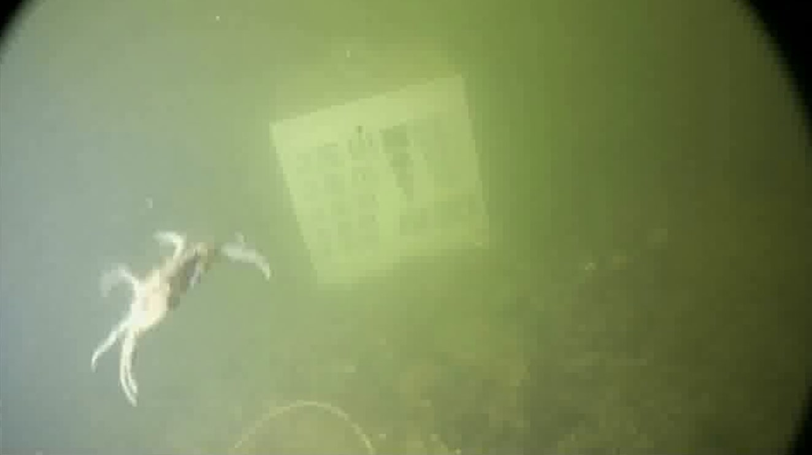
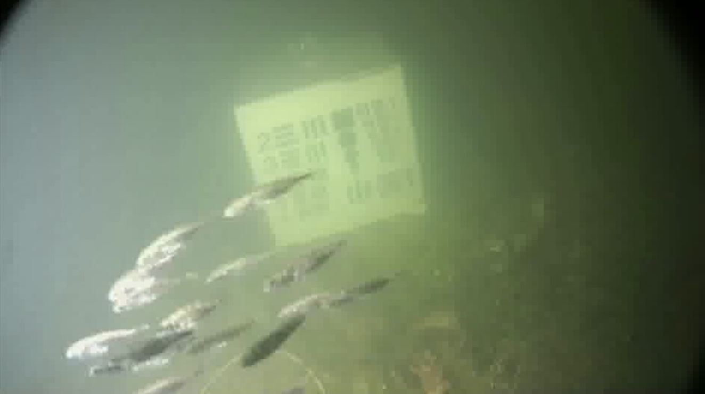
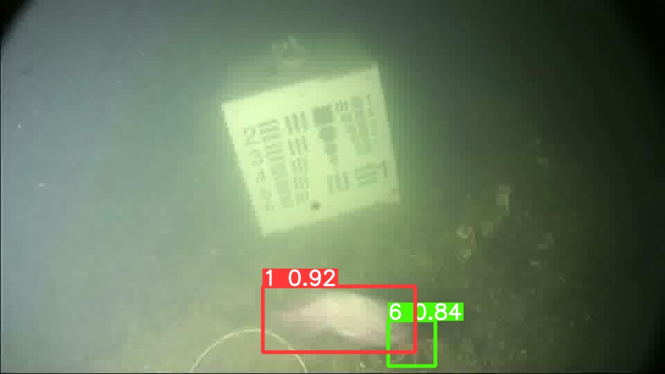

<div align="center">

# DeepSeaNet

**Improving underwater object detection using EfficientDet**

Detecting fish, crabs, shrimp and jellyfish in nine metres of murky Danish
coastal water — with a skip-connected feature-pyramid neck, adversarial
training, and class activation maps to check the model is looking at the animal
rather than the water.

[](https://ieeexplore.ieee.org/document/10541265)
[](https://arxiv.org/abs/2306.06075)
[](https://s4nyam.github.io/deepseanet/)
[](https://www.python.org/)
[](LICENSE)

[Quickstart](#quickstart) ·
[What's in here](#whats-in-here) ·
[Results](#results) ·
[The BiSkFPN neck](#the-biskfpn-neck) ·
[Scope](#scope-and-reproducibility) ·
[Citation](#citation)

</div>

---

## Why this is hard

Seawater is a hostile lens. It absorbs light, scatters it back into the camera,
and fills the frame with drifting particles. A detector has to find a shrimp a
few dozen pixels wide in that — and do it on continuous video, often on the
edge, which rules out slow two-stage detectors.

The paper calls this a *natural adversarial environment*: nothing is crafted by
an attacker, but the corruption degrades a network in much the same way. That
observation drives the two main ideas here — a neck that preserves fine detail
through fusion, and training against universal adversarial perturbations.

<div align="center">



<br>
<sub>Frames from the Brackish dataset, Limfjorden, Denmark. Right: predictions from the committed YOLOv8s run.</sub>
</div>

---

## Quickstart

```bash
git clone https://github.com/s4nyam/efficientdet-advml.git
cd efficientdet-advml
pip install -e '.[torch]'
```

Three things you can do immediately, with no dataset and no GPU:

```bash
# Summarise the training runs committed in this repository
deepseanet report --results results

# Compare the cost of the proposed neck against the baseline
deepseanet model --neck bifpn   --image-size 512
deepseanet model --neck biskfpn --image-size 512

# Run the test suite
pytest
```

Use the package directly:

```python
import torch
from deepseanet.models import DeepSeaNet, DeepSeaNetConfig

model = DeepSeaNet(DeepSeaNetConfig(num_classes=6, neck="biskfpn", image_size=512))
cls_logits, box_deltas, anchors = model(torch.randn(1, 3, 512, 512))
# cls_logits [1, A, 6]   box_deltas [1, A, 4]   anchors [A, 4] in xyxy pixels
```

---

## What's in here

```
efficientdet-advml/
├── src/deepseanet/          Installable package
│   ├── models/              Swish · MBConv backbone · BiFPN/BiSkFPN · head · detector
│   ├── losses.py            Focal · smooth-L1 · L2 · L = L_cls + αL_box + βL_reg
│   ├── attacks/uap.py       Universal adversarial perturbations + curriculum
│   ├── explain/             GradCAM++ and EigenCAM
│   ├── data/                Brackish preprocessing · format conversion · splits
│   ├── evaluate.py          Parse training logs into summary tables
│   └── cli.py               deepseanet prepare|convert|split|model|report|verify
├── notebooks/               The original experiments, secrets removed
│   ├── 00_dataset_preparation.ipynb
│   ├── 01_yolov5s.ipynb · 02_yolov8s.ipynb
│   ├── 03_efficientdet_lite0_350ep.ipynb
│   ├── 04_detectron2_faster_rcnn.ipynb
│   ├── 05–08_cam_*.ipynb    Class activation maps
│   └── legacy/              Earlier EfficientDet attempts, kept for provenance
├── results/                 Committed training logs, curves, the TFLite model
├── configs/                 YAML experiment configs, including the ablation
├── docs/                    Reproducibility · results · dataset · architecture · model card
├── tests/                   87 tests
├── assets/samples/          Representative frames and predictions
├── scripts/ · tools/        Weight download and checksum verification
└── .github/workflows/       Lint · test on 3.9/3.11/3.12 · secret scan
```

---

## Results

### Reported in the paper

| Model | Mean mAP ± Std (5 runs) |
|---|---|
| YOLOv3 | 31.1 ± 1.1 |
| YOLOv4 | 83.7 ± 1.4 |
| YOLOv5 | 97.6 ± 0.61 |
| YOLOv8 | 98.2 ± 0.17 |
| Detectron2 | 95.2 ± 1.4 |
| **Proposed EfficientDet** | **98.6 ± 1.0** |

With adversarial learning: EfficientDet **98.63**, YOLOv5 **98.04**.
The proposed model's largest class-wise margin is on **fish-small** (82.1
against 69.5 for the next best) — the class the skip path is designed to help.

Full tables, including class-wise results, in [`docs/RESULTS.md`](docs/RESULTS.md).

### Logged by the runs committed here

| Run | Epochs | AP@0.5 | AP@[.5:.95] | Precision | Recall | Source |
|---|---|---|---|---|---|---|
| YOLOv5s | 100 | 0.976 | 0.748 | 0.965 | 0.955 | `results/yolov5s/results.csv` |
| YOLOv8s | 100 | 0.988 | 0.836 | 0.993 | 0.977 | `results/yolov8s/results.csv` |
| EfficientDet-Lite0 | 350 | 0.898 | 0.601 | — | — | notebook output |
| Faster R-CNN X101-FPN | 300 iters | 0.433 | 0.204 | — | — | notebook output |

---

## The BiSkFPN neck

The paper's central contribution. Standard BiFPN fuses a feature pyramid
top-down then bottom-up, weighting each input edge. BiSkFPN builds every output
node from **three** sources instead of one:

```
BiSkFPN(P)ᵢ = concat( Pᵢ ,  deconv(Pᵢ₊₁) ,  skip_{i→i+1}(Pᵢ₋₁) )
```

| Branch | What it does | Why it's there |
|---|---|---|
| `Pᵢ` | the level itself, after BiFPN fusion | the baseline signal |
| `deconv(Pᵢ₊₁)` | up-samples the coarser level with a **learned transposed convolution** | recovers detail a parameter-free resize would not |
| `skip(Pᵢ₋₁)` | carries the finer level across, **bypassing the deconv branch** | edges and small blobs reach the head without surviving every fusion stage |

The robustness claim follows: when the input is perturbed, the fine-detail path
doesn't have to survive repeated re-mixing to influence the prediction.

**What it costs.** Measured, not estimated:

| Neck | Backbone | Neck | Head | Total |
|---|---|---|---|---|
| BiFPN | 8,575,168 | 187,065 | 39,258 | 8,801,491 |
| BiSkFPN | 8,575,168 | **1,259,001** | 39,258 | **9,873,427** |

About **1.07 M extra parameters**, 12% of the model, all in the neck.
`configs/deepseanet_bifpn.yaml` is the matched ablation baseline — run both
with the same seed before assuming the trade pays off on your data.

Implementation: [`src/deepseanet/models/biskfpn.py`](src/deepseanet/models/biskfpn.py).
Design rationale: [`docs/ARCHITECTURE.md`](docs/ARCHITECTURE.md).

---

## Adversarial training

A universal adversarial perturbation is a single image-agnostic pattern that,
added to almost any frame, pushes the network towards wrong predictions while
staying nearly invisible.

```python
from deepseanet.attacks import optimize_uap, apply_uap, curriculum_epsilon

delta = optimize_uap(model, batches, loss_fn, epsilon=8/255, steps=10)
perturbed = apply_uap(images, delta)

# Curriculum: first 20% of epochs clean, then ramp to full strength
eps = curriculum_epsilon(epoch, total_epochs=350, max_epsilon=8/255)
```

Two constructions are provided. `random_uap` is the closed form printed in the
paper — a fixed random sign pattern, cheap and fine as noise augmentation.
`optimize_uap` is the real attack: gradient ascent projected back onto the
`ℓ∞` ball. **Use the optimised one when measuring robustness** — a random
pattern is a weak adversary and will flatter your model.

---

## Explainability

```python
from deepseanet.explain import GradCAMPlusPlus

with GradCAMPlusPlus(model.eval(), model.neck.layers[-1]) as cam:
    heat = cam(images, score_fn=lambda out: out[0][..., class_id].amax(dim=1))
```

`EigenCAM` is also included — because that, not GradCAM++, is what the original
notebooks actually ran. Having both makes the comparison explicit rather than
accidental.

---


## Citation

```bibtex
@inproceedings{Jain2024DeepSeaNet,
  author    = {Jain, Sanyam},
  title     = {DeepSeaNet: Improving Underwater Object Detection using EfficientDet},
  booktitle = {2024 4th International Conference on Applied Artificial Intelligence (ICAPAI)},
  year      = {2024},
  pages     = {1--11},
  address   = {Halden, Norway},
  publisher = {IEEE},
  doi       = {10.1109/ICAPAI61893.2024.10541265}
}
```


---

## Acknowledgements

Completed as part of the Advanced Machine Learning course at Østfold University
College, Halden, Norway, taught by Prof. Ripon. Thanks to Perparim Mustafa for
access to the local HPC at HiØ.

Built on [EfficientDet](https://arxiv.org/abs/1911.09070),
[EfficientNet](https://arxiv.org/abs/1905.11946),
[Ultralytics YOLOv5/YOLOv8](https://github.com/ultralytics/ultralytics),
[Detectron2](https://github.com/facebookresearch/detectron2),
[pytorch-grad-cam](https://github.com/jacobgil/pytorch-grad-cam) and the
[Brackish dataset](https://www.kaggle.com/datasets/aalborguniversity/brackish-dataset).

## License

Code: [MIT](LICENSE). The Brackish dataset is licensed separately by Aalborg
University and is not distributed here.
